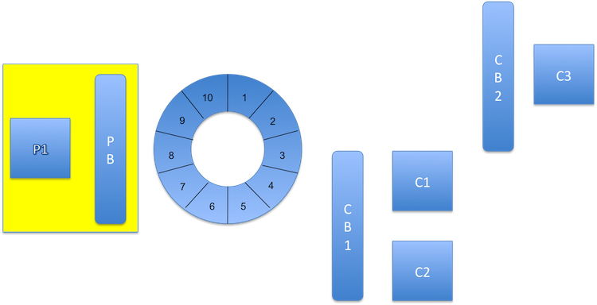
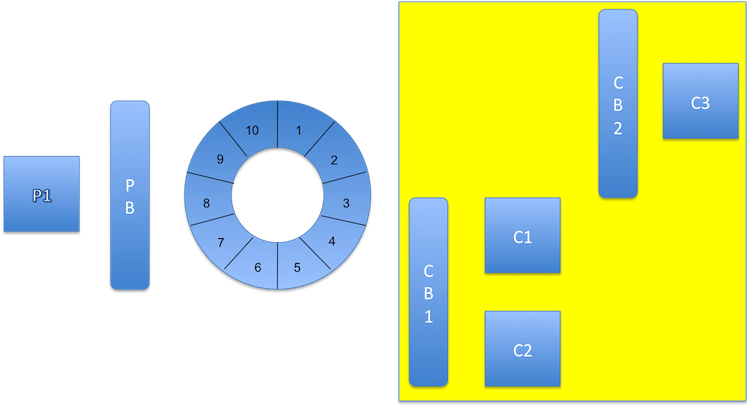
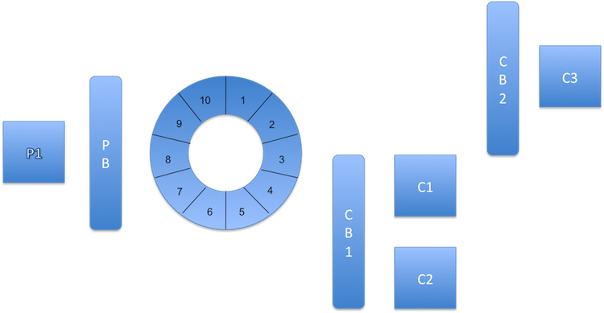

!SLIDE title-page

## LMAX Disruptor

Jamie Allen

jallen@chariotsolutions.com

@jamie_allen

August 10, 2011

!SLIDE transition=fade

# There is nothing new here

* "Virtual" runtime and deployment environment
* Breaks popular concurrency abstractions
* Not functional?!? (OMG! ONOZ!)

.notes
	* The "virtual" nature of our runtime and deployment environment has desensitized us as
	  developers to the impact of our design and implementation decisions
	* It flies in the face of popular concurrency abstractions to show what can be accomplished 
	  when implementing simple code in a highly-optimized fashion
	* This is a decidedly NOT functional implementation.  No referential transparency, lots of
	  shared mutable state

!SLIDE transition=fade

# How Did They Arrive at the Disruptor

* Betfair attempts the Flywheel and 100x projects
* Looked into J2EE, SEDA, Actors, etc

!SLIDE transition=fade

# How Did They Arrive at the Disruptor

* Betfair begets Tradefair/LMAX
* LMAX implements with a clean slate

!SLIDE transition=fade

# Mechanical Sympathy

* Jackie Stewart - all great drivers must understand how their machine works to derive the fastest time driving it
* "The most amazing achievement of the computer software industry is its continuing cancellation of the steady and staggering gains made by the computer hardware industry." - Henry Peteroski, as quoted on Martin's blog

!SLIDE transition=fade

# Keys to the Disruptor's Performance

* Control the core
* Avoid lock arbitration 
* Minimize usage of memory barriers
* Pre-allocate and reuse memory
* Thread control

!SLIDE transition=fade

# Avoid Locks

* Context switching is painful
* CAS semantics are much better, but no panacea
* Limited use of memory barriers are the key 

!SLIDE transition=fade

# What's Wrong With Queues

* Unbounded linked lists don't "stride"
* Bounded arrays share cache lines
* Cause heavy GC

!SLIDE transition=fade

# Memory Allocation

* Cache is king
* Pre-allocate and reuse
* Not functional programming
* Sequence data
* Cache lines and "false sharing"

!SLIDE transition=fade

# Caching

* registers
* store buffers
* L1 (SRAM)
* L2 (SRAM)
* L3 (SRAM)
* Main memory (DRAM)

!SLIDE transition=fade

# Cache Lines

* Cache "misses" are expensive
* Variables shouldn't share a cache line

!SLIDE transition=fade

# Cache Misses

* Compulsory
* Capacity
* Conflict
	* Mapping
	* Replacement

!SLIDE transition=fade

# Striding

* Predictable access begets pre-fetching
* Data structures must be contiguous

!SLIDE transition=fade

# Garbage Collection

* Reuse of memory prevents GC and compaction
* Restart every day to clear the heap

!SLIDE transition=fade

# Implementation: Ring Buffer

* Bounded
* Pre-allocated all at once
* Re-traversed
* Bit mask modulus
* Your network card

!SLIDE transition=fade

# Implementation: Producers

* Used for Network IO, file system reads, etc
* Sequencing
* Protect against overwriting data in use
* Claim Strategy
* Batching effect (later)
* Circuit breakers

!SLIDE transition=fade

# Implementation: Consumers

* Composable by ConsumerBarrier
* Sequencing
* Wait Strategy
* BatchingHandler (later)

!SLIDE transition=fade

# Dependency Graphs

* One data structure for all consumers
* Increased throughput
* Reduced latency

!SLIDE transition=fade

# Batching Effect

* Catch-up capability
* Performs better as load increases
* "J" curve effect on latency with queues is gone

!SLIDE transition=fade

# Event Sourcing

* Daily snapshot
* Daily restart to clear all memory
* Replay events and errors

!SLIDE transition=fade

# When to use a Disruptor

* BALANCED FLOW

!SLIDE transition=fade

# SDisruptor

* My Scala port: http://github.com/jamie-allen/sdisruptor
	* Array-based
	* Order of execution matters
	* For comprehensions
	* Companion objects

!SLIDE transition=fade

# SDisruptor: Arrays

    class RingBuffer[T <: AbstractEntry : ClassManifest](entryFactory: EntryFactory[T], 
    								size: Int,
                    var claimStrategyOption: Symbol,
                    var waitStrategyOption: Symbol) extends ProducerBarrier[T] {
      val entries: Array[T] = new Array[T](sizeAsPowerOfTwo)

!SLIDE transition=fade

# SDisruptor: Order of Execution

    var p1, p2, p3, p4, p5, p6, p7: Long = -1L  // cache line padding
    @volatile private var _sequence: Long = RingBuffer.InitialCursorValue
    var p8, p9, p10, p11, p12, p13, p14: Long = -1L // cache line padding

!SLIDE transition=fade

# SDisruptor: For Comprehensions

  	for (i <- 0 until upperBounds.length) {
	    if (0L != counts(i)) {
        val upperBound = Math.min(upperBounds(i), maxValue)
        val midPoint = lowerBound + ((upperBound - lowerBound) / 2L)

        val intervalTotal = new BigDecimal(midPoint).multiply(new BigDecimal(counts(i)))
        total = total.add(intervalTotal)
	    }

	    lowerBound = Math.max(upperBounds(i) + 1L, minValue)
  	}

!SLIDE transition=fade

# SDisruptor: For Comprehensions

    // for (i <- counts.length - 1 until -1 by -1) {
    for (i <- counts.indices.reverse) { // indices is O(1)!
      if (0L != counts(i)) {
        tailCount += counts(i)
        if (tailCount >= tailTotal) return upperBounds(i)
      }
    }

!SLIDE transition=fade

# Links

* Blog: Processing 1M TPS with Axon Framework and the Disruptor: http://blog.jteam.nl/2011/07/20/processing-1m-tps-with-axon-framework-and-the-disruptor/
* QCon presentation: http://www.infoq.com/presentations/LMAX
* Google Group: http://groups.google.com/group/lmax-disruptor
* Martin Fowler's Bliki post: http://martinfowler.com/articles/lmax.html
* Martin Thompson's Mechanical Sympathy blog: http://mechanical-sympathy.blogspot.com/
* Trisha Gee's Mechanitis Blog: http://mechanitis.blogspot.com/
* Disruptor Wizard (simplifying dependency wiring): http://github.com/ajsutton/disruptorWizard
* The Demise of the Low Level Programmer: http://altdevblogaday.com/2011/08/06/demise-low-level-programmer/

Martin and his team will be presenting at JavaOne 2011